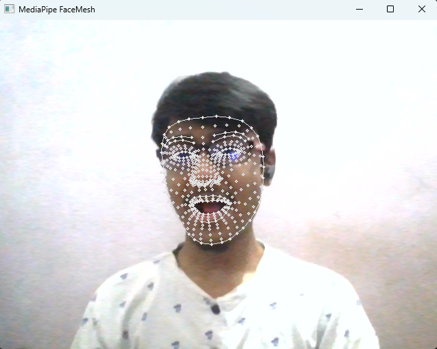
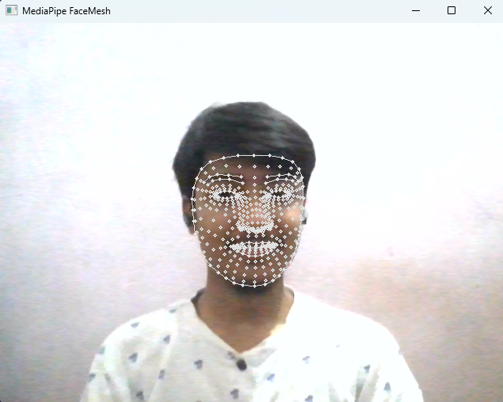

# Face Mesh Detection and Visualization

## Description
This project implements real-time face mesh detection and visualization using Python, OpenCV, and MediaPipe. It enables the identification of facial features and contours in real-time video streams.

## Features
- Real-time face mesh detection.
- Visualization of facial features and contours.
- Frame rate display for performance monitoring.

## Usage
1. **Prerequisites**: Ensure you have the necessary dependencies installed. You can install them using `pip`:

    ```bash
    pip install opencv-python mediapipe
    ```

2. **Run the Script**: Execute the Python script to start real-time face mesh detection:

    ```bash
    python Face_Mesh.py
    ```

3. **Controls**:
    - Press `q` to exit the application.
    - Press `c` to capture a screenshot with a timestamp.

## Screenshots



## Author
Vaibhav Srivastava

GitHub: [ZeusSama0001](https://github.com/ZeusSama0001)

## License

This project is licensed under the MIT License - see the [LICENSE.txt](LICENSE.txt) file for details.
